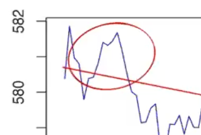

# Stat5703 Lec10: Time Series

## Overview

Go beyond the i.i.d. setting by allowing for temporal dependence. I We will consider continuous random variables evolving in time.

- Compared with regression?
  - If regression, errors are i.i.d, and thus for each point the observed should be equally likely to be higher or lower than the line.

### Measures of dependence

- Mean function
  - If $n$ observations, $n$ possible values of $\mu$ (impossible to estimate)
  - That's why we need stationary assumption to model it.
- Auto covariance function $\gamma(s,t)$
  - How correlated is it for the same R.V. between back in the past and forward in the future.

### Stationarity

- Second-order: about the first 2 moments 
- $E[Y_t]=\mu$ means are the same
- $cor(Y_s,Y_{s+t})=\gamma_t$ only depends on the range of interval
  - $var(Y_s)$ are all the same
- partial autocorrelation :question:

### Estimation

- $\hat{\gamma}_t=\frac{1}{n}\sum_i (Y_i - \bar{Y})(Y_{t+i}-\bar{Y})$
- $\hat{\gamma}'_t=cov(Y_0,Y_t|Y_1,...,Y_{t-1})$
  - Assuming Normal, we have $Y_A|Y_B\sim N(\mu_{A|B},\Sigma_{A|B})$
  - When we estimate it, larger the lag $t$ is, the smaller sample size $n$ is.

#### Comparison

- :bulb: note the ACF graph & partial ACF ones.
- Both $\sim N(0,n^{-1})$ if it's white noise.

### White noise

:question: Can we have an example which is independent but conditionally dependent?

### How to pick the right model?

- You can't just spot the pattern from the plot.

## Model: Auto-Regression

- $Y_t$ is stationary  <=> $|\alpha|<1$ :grey_question:
  - $E[Y_t]=\mu, var(Y_t)=\rho_0$  
- AR(1): $\rho'_1=\alpha; \rho'_t=0(t>1)$
- Comparison
  - When expanding to infinity, we get rid of dependence on $Y_t$, but a linear combination of white noise at different $t$.

### Estimation

- Freezing $Y_{t-1}$, then $Y_t|T_{t-1}\sim N(\alpha Y_{t-1},1)$. 

## Model: Moving Average

- $E[Y_t] = \mu;\ \rho_t=0\ (t>q)$ 

## Model: ARMA

- ARMA(p,q): Linear combination of white noise.
- Can ARMA model be rewritten as a MA of infinite order as we saw for AR models?  Yes.
- Both AR and MA are **linear processes**
  .

### Practice in computer

- Specifying p, q, software optimizing $\alpha_i, \beta_i$...

## Trend removal

- ARIMA(p,d,q): integrated autoregressive moving average
- d-fold differencing can be shown to remove a polynomial trend of order $d$.
- :question: $\tau_1$ a white noise?

## Volatility Model: ARCH

- Autoregressive conditional heteroscedastic:  capturing clustering behavior
  - A big shake following another one. (as in financial market)

## How to choose a model?

1. Remove trend & seasonality
2. Look at sample partial ACF and more
3. Check whether after fitting the residual fit white noise. 

