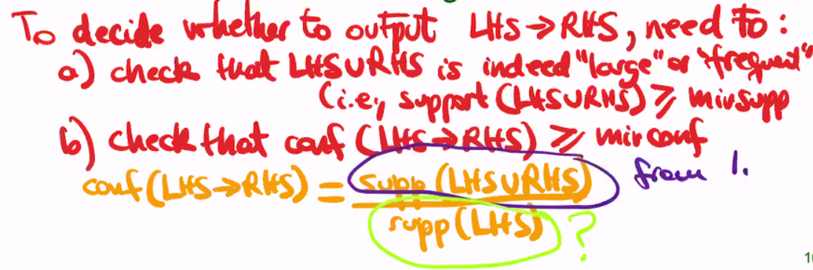

# Lec08: Data Mining

## Data Mining Tasks

- Association rules
- Time-series analysis
- ...

## Association rules

`{LHS}->{RHS}` (Shopping cart example.)

- Different from “function dependency” in database?
  - FD: SSN -> name (one with the same SSN must have the same name.)
  - Rules: {pen} -> {ink}

## Finding Association Rules

- **Support** for <u>a set of items</u>: % of transactions containing $LHS\cup RHS$
  - Statistical significance

- **Confidence** for <u>a rule</u>: % of tx containing LHS that also contain RHS
  - "Strength" of association
  - "confidence" threshold usually higher than "support" threshold.

```txt
pen, ink, diary, soap
pen, ink, diary
pen, diary
pen, ink, soap
```

$conf([pen, ink]\rightarrow[soap])=67\%$ and $supp([pen,ink,soap]) =50\%$

## Algorithms?

### Brute force

1. List all possible rules (*an exponential number*)
2. Scan table and compute support & confi`dence for each rule
3. Return rules with both $\geq$ threshold

### Observations for improvement?

1. Find all “large” (or “frequent”) item sets together with their support.
2. Derive all association rules with sufficient confidence from each large itemset.



#### Key Property of  Frequent Itemsets

:grey_question: Every subset of a large (frequent) itemset is also large (frequent).​

we should make sup(LHS) as a subroutine of solving sup(LHS & RHS) ?
- $sup(LHS) \geq sup(LHS\cup RHS)$

### Time complexity?

Priori algorithm: many scans but in each scan we calculate much less.

- $k+1$ scans of data table, $k:\#items$.
- Within each scan, :question: 

2020-3-31 15:45:08