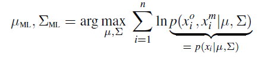
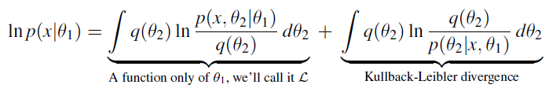

# Machine Learning: E-M algorithm

## Maximum likelihood

- Probabilistic objective function
- i.i.d. assumption of data $x_i$ 
- Simple case: model parameters set $\theta$

### Coordinate ascent

In more complicated cases... Although we can solve one given the other, we can’t solve it simultaneously

Similar to K-means.

## Expectation-Maximization algorithm

### Example: $x_i\in R$ with missing data

:question: how is it related to "the third" situation? lec 20 p7

Supposing we imputed the missing $x^m$, we can calculate the parameters easily.

For one observation $x_i$,

The $x^m$ here is treated as some **unknown while unwanted parameters** $\theta_2$.

- EM is a method than can **both learn parameters and <u>impute</u> missing values** at the same time.

### Objective function

We want a iterative method:

- $\ln p(x|\theta_1^{(t)})>\ln p(x|\theta_1^{(t-1)})$ 
- Converge at local maximum

### Algorithm

- E: supposing the $q(\theta_2)$ conditional on $\theta_1^{(t)}$, we have $L(\theta_1)\propto \ln p(x|\theta_1)$.
  - Setting $q(\theta_2)=p(\theta_2|x,\theta_1)$, so the above KL term values 0.
- M: argmax over $\theta_1$ of $L(\theta_1)$, we get $\theta_1^{(t+1)}$.

### Back to Missing values example

- :question: Did we just use the empirical mean to impute the missing data $x_i^m$?

